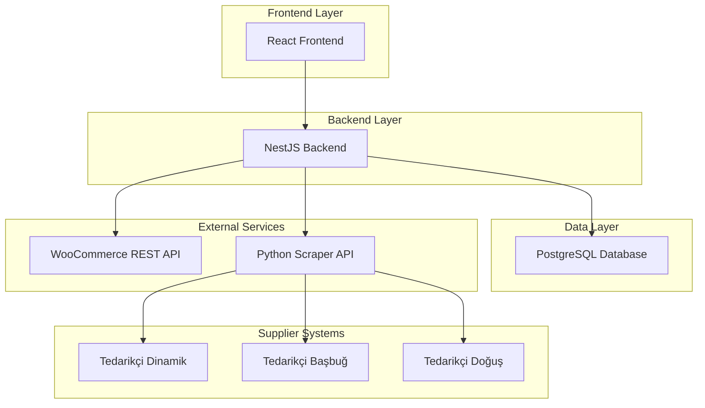
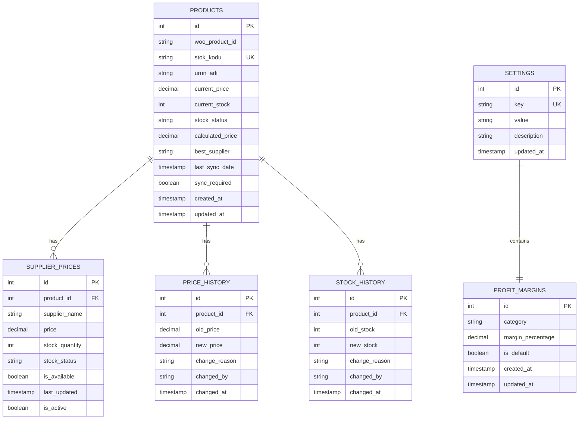
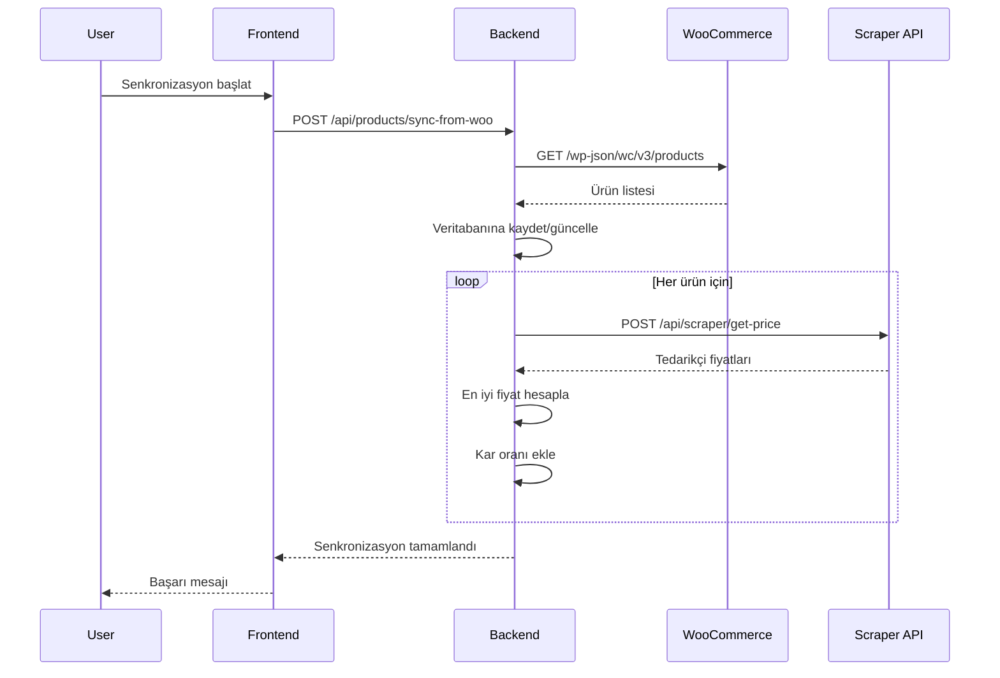
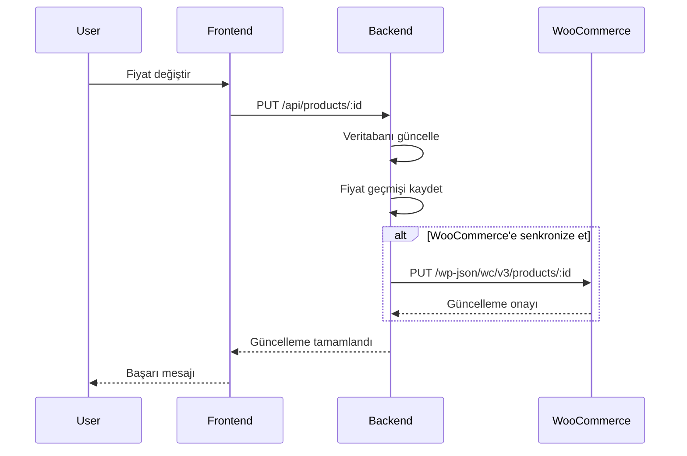

# Oto Parça Panel - Sistem Mimarisi ve Gereksinimler

## 1. Proje Genel Bakış

Oto Parça Panel, WooCommerce tabanlı e-ticaret sitesi ile entegre çalışan, 3 farklı tedarikçiden otomatik fiyat ve stok bilgisi çekerek en uygun fiyatlandırma yapan bir yönetim sistemidir. Sistem, belirlenen kar oranı ile otomatik fiyat hesaplaması yapar ve WooCommerce'e geri senkronize eder.

## 2. Ana Fonksiyonlar

### 2.1 WooCommerce Entegrasyonu

* WooCommerce REST API ile ürün bilgilerini çekme (stok kodu, ürün adı, fiyat)

* Panel üzerinde yapılan değişiklikleri WooCommerce'e geri gönderme

* Otomatik senkronizasyon ve manuel güncelleme seçenekleri

### 2.2 Tedarikçi Yönetimi

* 3 tedarikçi: Dinamik, Başbuğ, Doğuş

* Her tedarikçiden anlık fiyat ve stok bilgisi sorgulama

* En uygun tedarikçi seçimi (fiyat + stok durumu)

* Tedarikçi fiyat geçmişi takibi

### 2.3 Otomatik Fiyat Hesaplama

* En uygun tedarikçi fiyatı + belirlenen kar oranı = satış fiyatı

* Sistem ayarlarından kar oranı belirleme (%)

* Fiyat değişiklik geçmişi ve analizi

### 2.4 Stok ve Fiyat Yönetimi

* Gerçek zamanlı stok takibi

* Toplu fiyat güncelleme

* Stok uyarıları ve bildirimler

## 3. Sistem Mimarisi

### 3.1 Genel Mimari



### 3.2 Teknoloji Stack

**Frontend:**

* React 18 + TypeScript

* Tailwind CSS

* Next.js (App Router)

* React Query (veri yönetimi)

**Backend:**

* NestJS + TypeScript

* PostgreSQL (veritabanı)

* TypeORM (ORM)

* JWT Authentication

* Axios (HTTP client)

**External APIs:**

* WooCommerce REST API

* Python Scraper API (gelecekte)

## 4. Veritabanı Şeması

### 4.1 Veri Modeli



### 4.2 Veritabanı Tabloları

**Products (Ürünler)**

```sql
CREATE TABLE products (
    id SERIAL PRIMARY KEY,
    woo_product_id VARCHAR(50) UNIQUE,
    stok_kodu VARCHAR(100) UNIQUE NOT NULL,
    urun_adi VARCHAR(255) NOT NULL,
    current_price DECIMAL(10,2) DEFAULT 0,
    current_stock INTEGER DEFAULT 0,
    stock_status VARCHAR(20) DEFAULT 'outofstock',
    calculated_price DECIMAL(10,2) DEFAULT 0,
    best_supplier VARCHAR(50),
    last_sync_date TIMESTAMP,
    sync_required BOOLEAN DEFAULT true,
    is_active BOOLEAN DEFAULT true,
    created_at TIMESTAMP DEFAULT NOW(),
    updated_at TIMESTAMP DEFAULT NOW()
);

CREATE INDEX idx_products_stok_kodu ON products(stok_kodu);
CREATE INDEX idx_products_woo_id ON products(woo_product_id);
CREATE INDEX idx_products_sync_required ON products(sync_required);
```

**Supplier Prices (Tedarikçi Fiyatları)**

```sql
CREATE TABLE supplier_prices (
    id SERIAL PRIMARY KEY,
    product_id INTEGER REFERENCES products(id) ON DELETE CASCADE,
    supplier_name VARCHAR(50) NOT NULL CHECK (supplier_name IN ('Dinamik', 'Başbuğ', 'Doğuş')),
    price DECIMAL(10,2) NOT NULL DEFAULT 0,
    stock_quantity INTEGER DEFAULT 0,
    stock_status VARCHAR(20) DEFAULT 'outofstock',
    is_available BOOLEAN DEFAULT false,
    last_updated TIMESTAMP DEFAULT NOW(),
    is_active BOOLEAN DEFAULT true
);

CREATE INDEX idx_supplier_prices_product_id ON supplier_prices(product_id);
CREATE INDEX idx_supplier_prices_supplier ON supplier_prices(supplier_name);
CREATE UNIQUE INDEX idx_supplier_prices_unique ON supplier_prices(product_id, supplier_name);
```

**Settings (Sistem Ayarları)**

```sql
CREATE TABLE settings (
    id SERIAL PRIMARY KEY,
    key VARCHAR(100) UNIQUE NOT NULL,
    value TEXT NOT NULL,
    description TEXT,
    updated_at TIMESTAMP DEFAULT NOW()
);

-- Varsayılan ayarlar
INSERT INTO settings (key, value, description) VALUES
('default_profit_margin', '15', 'Varsayılan kar oranı (%)'),
('auto_sync_enabled', 'true', 'Otomatik senkronizasyon aktif mi'),
('sync_interval_minutes', '60', 'Senkronizasyon aralığı (dakika)'),
('woocommerce_api_url', '', 'WooCommerce API URL'),
('woocommerce_consumer_key', '', 'WooCommerce Consumer Key'),
('woocommerce_consumer_secret', '', 'WooCommerce Consumer Secret'),
('python_scraper_api_url', 'http://localhost:8000', 'Python Scraper API URL');
```

**Price History (Fiyat Geçmişi)**

```sql
CREATE TABLE price_history (
    id SERIAL PRIMARY KEY,
    product_id INTEGER REFERENCES products(id) ON DELETE CASCADE,
    old_price DECIMAL(10,2),
    new_price DECIMAL(10,2),
    change_reason VARCHAR(100),
    changed_by VARCHAR(100),
    changed_at TIMESTAMP DEFAULT NOW()
);

CREATE INDEX idx_price_history_product_id ON price_history(product_id);
CREATE INDEX idx_price_history_date ON price_history(changed_at DESC);
```

## 5. API Endpoints

### 5.1 Ürün Yönetimi

```typescript
// Ürün listesi
GET /api/products
Query: page, limit, search, stockStatus, supplier

// Ürün detayı
GET /api/products/:id

// Ürün güncelleme
PUT /api/products/:id
Body: { price?, stock?, sync_to_woo? }

// Toplu ürün güncelleme
PUT /api/products/bulk-update
Body: { productIds: number[], price?, stock?, sync_to_woo? }

// WooCommerce'den ürün çekme
POST /api/products/sync-from-woo
Body: { forceUpdate?: boolean }

// WooCommerce'e ürün gönderme
POST /api/products/sync-to-woo
Body: { productIds?: number[] }
```

### 5.2 Tedarikçi Yönetimi

```typescript
// Tedarikçi fiyatları
GET /api/suppliers/prices/:productId

// Tedarikçi fiyat güncelleme
POST /api/suppliers/update-prices
Body: { productIds: number[], suppliers?: string[] }

// En iyi tedarikçi seçimi
POST /api/suppliers/select-best
Body: { productId: number }

// Toplu en iyi tedarikçi seçimi
POST /api/suppliers/select-best-bulk
Body: { productIds: number[] }
```

### 5.3 Sistem Ayarları

```typescript
// Ayarları getir
GET /api/settings

// Ayar güncelle
PUT /api/settings/:key
Body: { value: string }

// Kar oranı ayarları
GET /api/settings/profit-margins
PUT /api/settings/profit-margins
Body: { default_margin: number, category_margins?: object }
```

## 6. İş Akışları

### 6.1 Ürün Senkronizasyon Akışı



### 6.2 Fiyat Güncelleme Akışı



## 7. Frontend Sayfaları

### 7.1 Ana Sayfalar

1. **Dashboard** - Genel bakış ve hızlı işlemler
2. **Ürün Yönetimi** - Ürün listesi, düzenleme, senkronizasyon
3. **Tedarikçi Fiyatları** - Tedarikçi karşılaştırma ve seçim
4. **Sistem Ayarları** - Kar oranı, API ayarları, genel konfigürasyon
5. **Fiyat Geçmişi** - Fiyat değişiklik raporları

### 7.2 Sayfa Detayları

| Sayfa               | Modül               | Özellik Açıklaması                                    |
| ------------------- | ------------------- | ----------------------------------------------------- |
| Dashboard           | Özet Kartları       | Toplam ürün, senkronizasyon durumu, son güncellemeler |
| Dashboard           | Hızlı İşlemler      | Toplu senkronizasyon, fiyat güncelleme butonları      |
| Ürün Yönetimi       | Ürün Listesi        | Filtreleme, arama, sayfalama, toplu işlemler          |
| Ürün Yönetimi       | Ürün Düzenleme      | Fiyat/stok güncelleme, tedarikçi fiyat görüntüleme    |
| Ürün Yönetimi       | Senkronizasyon      | WooCommerce ile manuel/otomatik senkronizasyon        |
| Tedarikçi Fiyatları | Fiyat Karşılaştırma | 3 tedarikçi fiyat tablosu, en iyi seçim önerisi       |
| Tedarikçi Fiyatları | Toplu Güncelleme    | Seçili ürünler için tedarikçi fiyat güncelleme        |
| Sistem Ayarları     | Kar Oranı           | Varsayılan ve kategori bazlı kar oranı ayarları       |
| Sistem Ayarları     | API Konfigürasyonu  | WooCommerce ve Scraper API ayarları                   |
| Sistem Ayarları     | Senkronizasyon      | Otomatik senkronizasyon aralığı ve kuralları          |

## 8. Güvenlik ve Performans

### 8.1 Güvenlik

* JWT tabanlı kimlik doğrulama

* API rate limiting

* Input validation ve sanitization

* HTTPS zorunluluğu

* Database connection encryption

### 8.2 Performans

* Database indexing

* API response caching

* Lazy loading

* Pagination

* Background job processing

## 9. Gelecek Geliştirmeler

1. **Python Scraper API** - Tedarikçi sitelerinden otomatik veri çekme
2. **Mobil Uygulama** - React Native ile mobil yönetim
3. **Raporlama** - Detaylı satış ve kar analizi
4. **Bildirimler** - Email/SMS uyarı sistemi
5. **Multi-store** - Birden fazla WooCommerce mağaza desteği

