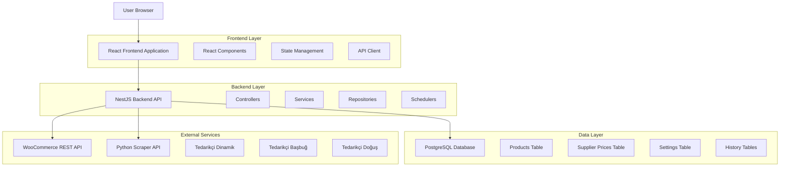
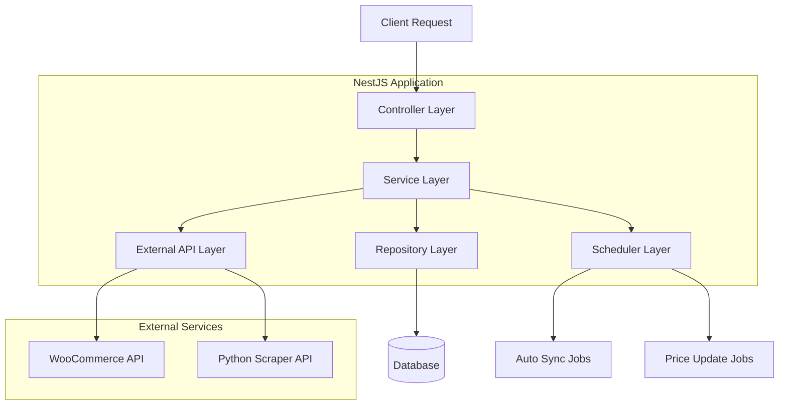
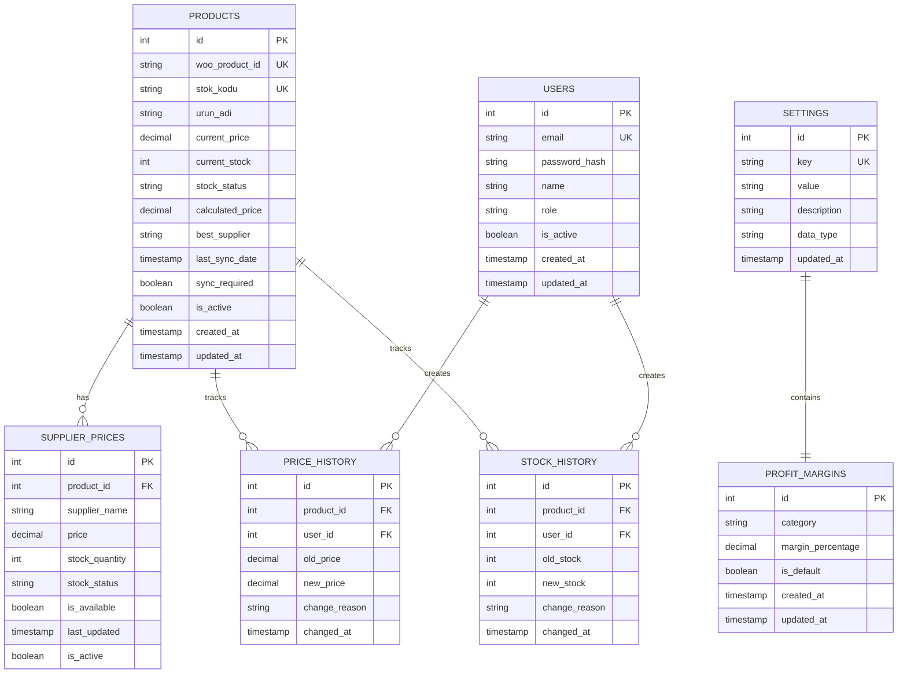

# Teknik Mimari Dokümantasyonu

## 1. Mimari Tasarım



## 2. Teknoloji Açıklaması

* **Frontend:** React\@18 + TypeScript + Tailwind CSS + Next.js

* **Backend:** NestJS\@10 + TypeScript + TypeORM

* **Database:** PostgreSQL\@15

* **External APIs:** WooCommerce REST API, Python Scraper API

## 3. Route Tanımları

| Route         | Amaç                                                      |
| ------------- | --------------------------------------------------------- |
| /             | Ana sayfa - Dashboard'a yönlendirme                       |
| /dashboard    | Dashboard sayfası - genel bakış ve hızlı işlemler         |
| /products     | Ürün yönetimi sayfası - ürün listesi ve düzenleme         |
| /products/:id | Ürün detay sayfası - tekil ürün yönetimi                  |
| /suppliers    | Tedarikçi fiyatları sayfası - fiyat karşılaştırma         |
| /settings     | Sistem ayarları sayfası - kar oranı ve API konfigürasyonu |
| /history      | Fiyat geçmişi sayfası - değişiklik raporları              |
| /login        | Giriş sayfası - kullanıcı kimlik doğrulama                |

## 4. API Tanımları

### 4.1 Ürün Yönetimi API'ları

**Ürün listesi**

```
GET /api/products
```

Request Parameters:

| Parametre   | Tip    | Zorunlu | Açıklama                            |
| ----------- | ------ | ------- | ----------------------------------- |
| page        | number | false   | Sayfa numarası (varsayılan: 1)      |
| limit       | number | false   | Sayfa başına kayıt (varsayılan: 20) |
| search      | string | false   | Ürün adı veya stok kodu araması     |
| stockStatus | string | false   | Stok durumu filtresi                |
| supplier    | string | false   | Tedarikçi filtresi                  |

Response:

```json
{
  "success": true,
  "data": [
    {
      "id": 1,
      "stok_kodu": "ABC123",
      "urun_adi": "Fren Balata",
      "current_price": 150.00,
      "current_stock": 25,
      "calculated_price": 172.50,
      "best_supplier": "Dinamik",
      "sync_required": false
    }
  ],
  "pagination": {
    "page": 1,
    "limit": 20,
    "total": 150,
    "totalPages": 8
  }
}
```

**Ürün güncelleme**

```
PUT /api/products/:id
```

Request:

| Parametre     | Tip     | Zorunlu | Açıklama                    |
| ------------- | ------- | ------- | --------------------------- |
| price         | number  | false   | Yeni fiyat                  |
| stock         | number  | false   | Yeni stok miktarı           |
| sync\_to\_woo | boolean | false   | WooCommerce'e senkronize et |

Response:

```json
{
  "success": true,
  "data": {
    "id": 1,
    "updated_fields": ["price", "stock"],
    "woo_sync_status": "completed"
  }
}
```

### 4.2 Tedarikçi Yönetimi API'ları

**Tedarikçi fiyatları**

```
GET /api/suppliers/prices/:productId
```

Response:

```json
{
  "success": true,
  "data": {
    "product_id": 1,
    "suppliers": [
      {
        "name": "Dinamik",
        "price": 120.00,
        "stock_quantity": 50,
        "stock_status": "instock",
        "is_available": true,
        "last_updated": "2025-01-24T10:30:00Z"
      },
      {
        "name": "Başbuğ",
        "price": 125.00,
        "stock_quantity": 30,
        "stock_status": "instock",
        "is_available": true,
        "last_updated": "2025-01-24T10:25:00Z"
      },
      {
        "name": "Doğuş",
        "price": 130.00,
        "stock_quantity": 0,
        "stock_status": "outofstock",
        "is_available": false,
        "last_updated": "2025-01-24T09:45:00Z"
      }
    ],
    "best_supplier": {
      "name": "Dinamik",
      "price": 120.00,
      "calculated_price": 138.00,
      "profit_margin": 15
    }
  }
}
```

**Tedarikçi fiyat güncelleme**

```
POST /api/suppliers/update-prices
```

Request:

| Parametre  | Tip       | Zorunlu | Açıklama                                |
| ---------- | --------- | ------- | --------------------------------------- |
| productIds | number\[] | true    | Güncellenecek ürün ID'leri              |
| suppliers  | string\[] | false   | Belirli tedarikçiler (varsayılan: tümü) |

Response:

```json
{
  "success": true,
  "data": {
    "updated_products": 25,
    "failed_products": 2,
    "processing_time": "45 seconds",
    "details": [
      {
        "product_id": 1,
        "status": "success",
        "updated_suppliers": ["Dinamik", "Başbuğ"]
      }
    ]
  }
}
```

### 4.3 WooCommerce Senkronizasyon API'ları

**WooCommerce'den ürün çekme**

```
POST /api/woocommerce/sync-from
```

Request:

| Parametre   | Tip     | Zorunlu | Açıklama                            |
| ----------- | ------- | ------- | ----------------------------------- |
| forceUpdate | boolean | false   | Mevcut ürünleri zorla güncelle      |
| batchSize   | number  | false   | Toplu işlem boyutu (varsayılan: 50) |

Response:

```json
{
  "success": true,
  "data": {
    "total_products": 150,
    "new_products": 25,
    "updated_products": 30,
    "skipped_products": 95,
    "processing_time": "2 minutes 15 seconds"
  }
}
```

**WooCommerce'e ürün gönderme**

```
POST /api/woocommerce/sync-to
```

Request:

| Parametre    | Tip       | Zorunlu | Açıklama                                                  |
| ------------ | --------- | ------- | --------------------------------------------------------- |
| productIds   | number\[] | false   | Belirli ürünler (varsayılan: sync\_required=true olanlar) |
| updateFields | string\[] | false   | Güncellenecek alanlar (price, stock, status)              |

Response:

```json
{
  "success": true,
  "data": {
    "synced_products": 45,
    "failed_products": 3,
    "processing_time": "1 minute 30 seconds",
    "errors": [
      {
        "product_id": 15,
        "error": "Product not found in WooCommerce"
      }
    ]
  }
}
```

### 4.4 Sistem Ayarları API'ları

**Ayarları getir**

```
GET /api/settings
```

Response:

```json
{
  "success": true,
  "data": {
    "default_profit_margin": 15,
    "auto_sync_enabled": true,
    "sync_interval_minutes": 60,
    "woocommerce_api_url": "https://example.com",
    "python_scraper_api_url": "http://localhost:8000"
  }
}
```

**Kar oranı güncelleme**

```
PUT /api/settings/profit-margin
```

Request:

| Parametre          | Tip    | Zorunlu | Açıklama      |
| ------------------ | ------ | ------- | ------------- |
| margin\_percentage | number | true    | Kar oranı (%) |

Response:

```json
{
  "success": true,
  "data": {
    "old_margin": 15,
    "new_margin": 18,
    "affected_products": 125
  }
}
```

## 5. Sunucu Mimarisi



## 6. Veri Modeli

### 6.1 Veri Modeli Tanımı



### 6.2 Veri Tanımlama Dili (DDL)

**Products Tablosu**

```sql
CREATE TABLE products (
    id SERIAL PRIMARY KEY,
    woo_product_id VARCHAR(50) UNIQUE,
    stok_kodu VARCHAR(100) UNIQUE NOT NULL,
    urun_adi VARCHAR(255) NOT NULL,
    current_price DECIMAL(10,2) DEFAULT 0.00,
    current_stock INTEGER DEFAULT 0,
    stock_status VARCHAR(20) DEFAULT 'outofstock' CHECK (stock_status IN ('instock', 'outofstock', 'onbackorder')),
    calculated_price DECIMAL(10,2) DEFAULT 0.00,
    best_supplier VARCHAR(50) CHECK (best_supplier IN ('Dinamik', 'Başbuğ', 'Doğuş')),
    last_sync_date TIMESTAMP,
    sync_required BOOLEAN DEFAULT true,
    is_active BOOLEAN DEFAULT true,
    created_at TIMESTAMP DEFAULT NOW(),
    updated_at TIMESTAMP DEFAULT NOW()
);

-- İndeksler
CREATE INDEX idx_products_stok_kodu ON products(stok_kodu);
CREATE INDEX idx_products_woo_id ON products(woo_product_id);
CREATE INDEX idx_products_sync_required ON products(sync_required);
CREATE INDEX idx_products_best_supplier ON products(best_supplier);
CREATE INDEX idx_products_updated_at ON products(updated_at DESC);
```

**Supplier Prices Tablosu**

```sql
CREATE TABLE supplier_prices (
    id SERIAL PRIMARY KEY,
    product_id INTEGER NOT NULL REFERENCES products(id) ON DELETE CASCADE,
    supplier_name VARCHAR(50) NOT NULL CHECK (supplier_name IN ('Dinamik', 'Başbuğ', 'Doğuş')),
    price DECIMAL(10,2) NOT NULL DEFAULT 0.00,
    stock_quantity INTEGER DEFAULT 0,
    stock_status VARCHAR(20) DEFAULT 'outofstock' CHECK (stock_status IN ('instock', 'outofstock', 'onbackorder')),
    is_available BOOLEAN DEFAULT false,
    last_updated TIMESTAMP DEFAULT NOW(),
    is_active BOOLEAN DEFAULT true
);

-- İndeksler
CREATE INDEX idx_supplier_prices_product_id ON supplier_prices(product_id);
CREATE INDEX idx_supplier_prices_supplier ON supplier_prices(supplier_name);
CREATE INDEX idx_supplier_prices_available ON supplier_prices(is_available);
CREATE UNIQUE INDEX idx_supplier_prices_unique ON supplier_prices(product_id, supplier_name) WHERE is_active = true;
```

**Settings Tablosu**

```sql
CREATE TABLE settings (
    id SERIAL PRIMARY KEY,
    key VARCHAR(100) UNIQUE NOT NULL,
    value TEXT NOT NULL,
    description TEXT,
    data_type VARCHAR(20) DEFAULT 'string' CHECK (data_type IN ('string', 'number', 'boolean', 'json')),
    updated_at TIMESTAMP DEFAULT NOW()
);

-- Varsayılan ayarlar
INSERT INTO settings (key, value, description, data_type) VALUES
('default_profit_margin', '15', 'Varsayılan kar oranı (%)', 'number'),
('auto_sync_enabled', 'true', 'Otomatik senkronizasyon aktif mi', 'boolean'),
('sync_interval_minutes', '60', 'Senkronizasyon aralığı (dakika)', 'number'),
('woocommerce_api_url', '', 'WooCommerce API URL', 'string'),
('woocommerce_consumer_key', '', 'WooCommerce Consumer Key', 'string'),
('woocommerce_consumer_secret', '', 'WooCommerce Consumer Secret', 'string'),
('python_scraper_api_url', 'http://localhost:8000', 'Python Scraper API URL', 'string'),
('min_stock_threshold', '5', 'Minimum stok uyarı seviyesi', 'number'),
('max_price_change_percent', '20', 'Maksimum fiyat değişim oranı (%)', 'number');
```

**Price History Tablosu**

```sql
CREATE TABLE price_history (
    id SERIAL PRIMARY KEY,
    product_id INTEGER NOT NULL REFERENCES products(id) ON DELETE CASCADE,
    user_id INTEGER REFERENCES users(id),
    old_price DECIMAL(10,2),
    new_price DECIMAL(10,2),
    change_reason VARCHAR(100),
    change_source VARCHAR(50) DEFAULT 'manual' CHECK (change_source IN ('manual', 'auto_sync', 'supplier_update', 'woo_sync')),
    changed_at TIMESTAMP DEFAULT NOW()
);

-- İndeksler
CREATE INDEX idx_price_history_product_id ON price_history(product_id);
CREATE INDEX idx_price_history_date ON price_history(changed_at DESC);
CREATE INDEX idx_price_history_source ON price_history(change_source);
```

**Stock History Tablosu**

```sql
CREATE TABLE stock_history (
    id SERIAL PRIMARY KEY,
    product_id INTEGER NOT NULL REFERENCES products(id) ON DELETE CASCADE,
    user_id INTEGER REFERENCES users(id),
    old_stock INTEGER,
    new_stock INTEGER,
    change_reason VARCHAR(100),
    change_source VARCHAR(50) DEFAULT 'manual' CHECK (change_source IN ('manual', 'auto_sync', 'supplier_update', 'woo_sync')),
    changed_at TIMESTAMP DEFAULT NOW()
);

-- İndeksler
CREATE INDEX idx_stock_history_product_id ON stock_history(product_id);
CREATE INDEX idx_stock_history_date ON stock_history(changed_at DESC);
CREATE INDEX idx_stock_history_source ON stock_history(change_source);
```

**Users Tablosu**

```sql
CREATE TABLE users (
    id SERIAL PRIMARY KEY,
    email VARCHAR(255) UNIQUE NOT NULL,
    password_hash VARCHAR(255) NOT NULL,
    name VARCHAR(100) NOT NULL,
    role VARCHAR(20) DEFAULT 'user' CHECK (role IN ('admin', 'user')),
    is_active BOOLEAN DEFAULT true,
    last_login TIMESTAMP,
    created_at TIMESTAMP DEFAULT NOW(),
    updated_at TIMESTAMP DEFAULT NOW()
);

-- İndeksler
CREATE INDEX idx_users_email ON users(email);
CREATE INDEX idx_users_role ON users(role);

-- Varsayılan admin kullanıcı
INSERT INTO users (email, password_hash, name, role) VALUES
('admin@otoparcapanel.com', '$2b$10$example_hash', 'Admin User', 'admin');
```

