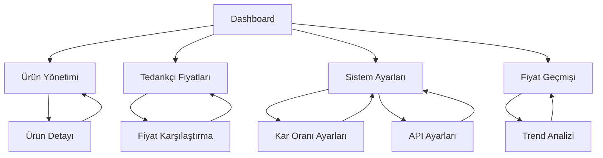

# Ürün Gereksinimleri Dokümanı (PRD)

## 1. Ürün Genel Bakışı

Oto Parça Panel, WooCommerce e-ticaret sitesi ile entegre çalışan, 3 farklı tedarikçiden otomatik fiyat ve stok bilgisi alarak en uygun fiyatlandırma yapan bir yönetim sistemidir. Sistem, belirlenen kar oranı ile otomatik fiyat hesaplaması yapar ve WooCommerce'e senkronize eder.

Sistem, oto yedek parça satışı yapan e-ticaret işletmelerinin tedarikçi yönetimi ve fiyatlandırma süreçlerini otomatikleştirerek operasyonel verimliliği artırmayı hedefler.

## 2. Temel Özellikler

### 2.1 Kullanıcı Rolleri

| Rol       | Kayıt Yöntemi                 | Temel Yetkiler                                               |
| --------- | ----------------------------- | ------------------------------------------------------------ |
| Admin     | Sistem tarafından oluşturulan | Tüm sistem ayarları, kullanıcı yönetimi, kar oranı belirleme |
| Kullanıcı | Admin tarafından davet        | Ürün görüntüleme, fiyat/stok güncelleme, senkronizasyon      |

### 2.2 Özellik Modülü

Sistemimiz aşağıdaki ana sayfalardan oluşmaktadır:

1. **Dashboard**: Genel bakış kartları, hızlı işlem butonları, son aktiviteler
2. **Ürün Yönetimi**: Ürün listesi, filtreleme, düzenleme, toplu işlemler
3. **Tedarikçi Fiyatları**: 3 tedarikçi fiyat karşılaştırma, en iyi seçim önerisi
4. **Sistem Ayarları**: Kar oranı ayarları, API konfigürasyonu, senkronizasyon kuralları
5. **Fiyat Geçmişi**: Fiyat değişiklik raporları, trend analizi

### 2.3 Sayfa Detayları

| Sayfa Adı           | Modül Adı           | Özellik Açıklaması                                                             |
| ------------------- | ------------------- | ------------------------------------------------------------------------------ |
| Dashboard           | Özet Kartları       | Toplam ürün sayısı, senkronizasyon durumu, stok uyarıları gösterimi            |
| Dashboard           | Hızlı İşlemler      | WooCommerce senkronizasyon, tedarikçi fiyat güncelleme, toplu işlem butonları  |
| Dashboard           | Son Aktiviteler     | Fiyat değişiklikleri, stok güncellemeleri, senkronizasyon logları              |
| Ürün Yönetimi       | Ürün Listesi        | Sayfalama, arama, filtreleme (stok durumu, tedarikçi), sıralama özellikleri    |
| Ürün Yönetimi       | Ürün Düzenleme      | Fiyat/stok güncelleme, WooCommerce senkronizasyon, tedarikçi fiyat görüntüleme |
| Ürün Yönetimi       | Toplu İşlemler      | Seçili ürünler için fiyat güncelleme, stok güncelleme, senkronizasyon          |
| Tedarikçi Fiyatları | Fiyat Karşılaştırma | 3 tedarikçi fiyat tablosu, stok durumu, son güncelleme tarihi                  |
| Tedarikçi Fiyatları | En İyi Seçim        | Otomatik en uygun tedarikçi önerisi, kar oranı hesaplama                       |
| Tedarikçi Fiyatları | Toplu Güncelleme    | Seçili ürünler için tedarikçi fiyat sorgulama ve güncelleme                    |
| Sistem Ayarları     | Kar Oranı           | Varsayılan kar oranı belirleme, kategori bazlı kar oranları                    |
| Sistem Ayarları     | API Ayarları        | WooCommerce API bilgileri, Python Scraper API URL'i                            |
| Sistem Ayarları     | Senkronizasyon      | Otomatik senkronizasyon aralığı, senkronizasyon kuralları                      |
| Fiyat Geçmişi       | Değişiklik Listesi  | Fiyat değişiklik geçmişi, değişiklik nedeni, kullanıcı bilgisi                 |
| Fiyat Geçmişi       | Trend Analizi       | Fiyat trend grafikleri, istatistiksel analiz                                   |

## 3. Temel Süreçler

### 3.1 Ana Kullanıcı İş Akışları

**WooCommerce Senkronizasyon Akışı:**

1. Kullanıcı dashboard'da "WooCommerce'den Ürün Çek" butonuna tıklar
2. Sistem WooCommerce API'den ürün listesini çeker
3. Yeni ürünler veritabanına eklenir, mevcut ürünler güncellenir
4. Her ürün için tedarikçi fiyatları sorgulanır
5. En uygun tedarikçi seçilir ve kar oranı eklenerek fiyat hesaplanır
6. Kullanıcıya senkronizasyon raporu gösterilir

**Fiyat Güncelleme Akışı:**

1. Kullanıcı ürün listesinde bir ürünün fiyatını değiştirir
2. Sistem fiyat değişikliğini veritabanına kaydeder
3. Fiyat geçmişi tablosuna kayıt eklenir
4. İsteğe bağlı olarak WooCommerce'e senkronize edilir
5. Kullanıcıya başarı mesajı gösterilir

**Tedarikçi Fiyat Güncelleme Akışı:**

1. Kullanıcı "Tedarikçi Fiyatlarını Güncelle" butonuna tıklar
2. Sistem Python Scraper API'ye ürün bilgilerini gönderir
3. Her tedarikçiden fiyat ve stok bilgisi alınır
4. En uygun tedarikçi otomatik seçilir
5. Kar oranı eklenerek yeni fiyat hesaplanır
6. Ürün bilgileri güncellenir ve kullanıcıya rapor gösterilir

### 3.2 Sayfa Navigasyon Akışı

## 4. Kullanıcı Arayüzü Tasarımı

### 4.1 Tasarım Stili

* **Ana Renkler:** Mavi (#3B82F6), Yeşil (#10B981), Kırmızı (#EF4444)

* **İkincil Renkler:** Gri tonları (#F8FAFC, #64748B), Turuncu (#F59E0B)

* **Buton Stili:** Yuvarlatılmış köşeler (8px), gölge efektli, hover animasyonları

* **Font:** Inter, 14px varsayılan boyut, 16px başlıklar için

* **Layout Stili:** Kartlar tabanlı tasarım, sol navigasyon menüsü, responsive grid sistem

* **İkon Stili:** Lucide React ikonları, 16px-24px boyutları

### 4.2 Sayfa Tasarım Genel Bakışı

| Sayfa Adı           | Modül Adı       | UI Elementleri                                                             |
| ------------------- | --------------- | -------------------------------------------------------------------------- |
| Dashboard           | Özet Kartları   | Mavi gradient kartlar, beyaz arka plan, gölge efekti, ikonlar sağ üst köşe |
| Dashboard           | Hızlı İşlemler  | Büyük butonlar, renkli ikonlar, hover efektleri, grid layout               |
| Ürün Yönetimi       | Ürün Listesi    | Tablo görünümü, alternatif satır renkleri, sıralama ok ikonları, sayfalama |
| Ürün Yönetimi       | Filtreleme      | Dropdown menüler, arama kutusu, temizle butonu, filtre sayısı göstergesi   |
| Tedarikçi Fiyatları | Fiyat Tablosu   | 3 sütunlu tablo, renk kodlu stok durumu, en iyi fiyat vurgulama            |
| Tedarikçi Fiyatları | Karşılaştırma   | Yan yana kartlar, fiyat karşılaştırma grafikleri, önerilen seçim vurgulama |
| Sistem Ayarları     | Form Alanları   | Label-input çiftleri, yardım metinleri, doğrulama mesajları                |
| Sistem Ayarları     | Kaydet Butonu   | Yeşil renk, sağ alt köşe sabit pozisyon, loading animasyonu                |
| Fiyat Geçmişi       | Zaman Çizelgesi | Dikey timeline, tarih göstergeleri, değişiklik detayları                   |
| Fiyat Geçmişi       | Grafik Görünümü | Line chart, renk kodlu çizgiler, zoom özelliği, tooltip bilgileri          |

### 4.3 Responsive Tasarım

Sistem desktop-first yaklaşımı ile tasarlanmıştır. Tablet ve mobil cihazlarda:

* Sol navigasyon menüsü hamburger menüye dönüşür

* Kartlar tek sütun halinde dizilir

* Tablolar yatay kaydırma özelliği kazanır

* Touch optimizasyonu için buton boyutları artırılır

* Minimum dokunma alanı 44px olarak belirlenir

## 5. Teknik Gereksinimler

### 5.1 Performans Gereksinimleri

* Sayfa yükleme süresi: Maksimum 3 saniye

* API yanıt süresi: Maksimum 2 saniye

* Eş zamanlı kullanıcı kapasitesi: 50 kullanıcı

* Veritabanı sorgu optimizasyonu: İndeksli sorgular

### 5.2 Güvenlik Gereksinimleri

* JWT tabanlı kimlik doğrulama

* API rate limiting (100 istek/dakika)

* Input validation ve sanitization

* HTTPS zorunluluğu

* Şifre hashleme (bcrypt)

### 5.3 Entegrasyon Gereksinimleri

* WooCommerce REST API v3 uyumluluğu

* Python Scraper API entegrasyonu

* PostgreSQL veritabanı desteği

* Real-time bildirimler (WebSocket)

## 6. Kabul Kriterleri

### 6.1 Fonksiyonel Kriterler

* ✅ WooCommerce'den ürün çekme işlemi başarılı olmalı

* ✅ 3 tedarikçiden fiyat bilgisi alınabilmeli

* ✅ En uygun tedarikçi otomatik seçilebilmeli

* ✅ Kar oranı hesaplaması doğru çalışmalı

* ✅ WooCommerce'e fiyat/stok güncellemesi yapılabilmeli

* ✅ Fiyat değişiklik geçmişi tutulmalı

* ✅ Toplu işlemler çalışmalı

### 6.2 Teknik Kriterler

* ✅ Sistem 7/24 çalışır durumda olmalı

* ✅ Veri kaybı yaşanmamalı

* ✅ API hataları graceful handle edilmeli

* ✅ Responsive tasarım tüm cihazlarda çalışmalı

* ✅ Güvenlik açıkları bulunmamalı

### 6.3 Kullanıcı Deneyimi Kriterleri

* ✅ Arayüz sezgisel ve kullanımı kolay olmalı

* ✅ Hata mesajları anlaşılır olmalı

* ✅ Loading durumları görsel olarak belirtilmeli

* ✅ Başarı/hata bildirimleri gösterilmeli

* ✅ Klavye navigasyonu desteklenmeli

## 7. Gelecek Özellikler

### 7.1 Faz 2 Özellikleri

* **Gelişmiş Raporlama:** Satış analizi, kar marjı raporları, trend analizleri

* **Mobil Uygulama:** React Native ile iOS/Android uygulaması

* **Bildirim Sistemi:** Email/SMS uyarıları, stok azalma bildirimleri

* **Multi-store Desteği:** Birden fazla WooCommerce mağaza yönetimi

### 7.2 Faz 3 Özellikleri

* **AI Destekli Fiyatlandırma:** Makine öğrenmesi ile optimal fiyat önerisi

* **Tedarikçi Performans Analizi:** Tedarikçi güvenilirlik skorları

* **Otomatik Sipariş Sistemi:** Stok azaldığında otomatik sipariş oluşturma

* **API Marketplace:** Üçüncü parti entegrasyonlar için API marketplace

## 8. Risk Analizi

### 8.1 Teknik Riskler

* **WooCommerce API Değişiklikleri:** API versiyonu güncellemelerinde uyumsuzluk

* **Tedarikçi Site Değişiklikleri:** Scraper'ın çalışmaması

* **Performans Sorunları:** Büyük ürün kataloglarında yavaşlama

### 8.2 İş Riskleri

* **Tedarikçi Fiyat Değişiklikleri:** Ani fiyat artışları

* **Stok Uyumsuzlukları:** Tedarikçi ve sistem arasında stok farkları

* **Kullanıcı Adaptasyonu:** Mevcut süreçlerden yeni sisteme geçiş zorluğu

### 8.3 Risk Azaltma Stratejileri

* Düzenli API testleri ve monitoring

* Fallback mekanizmaları ve hata yönetimi

* Kullanıcı eğitimi ve dokümantasyon

* Aşamalı geçiş planı

